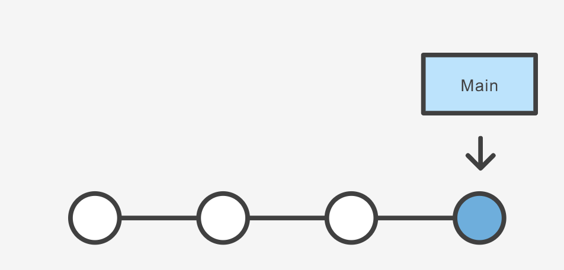
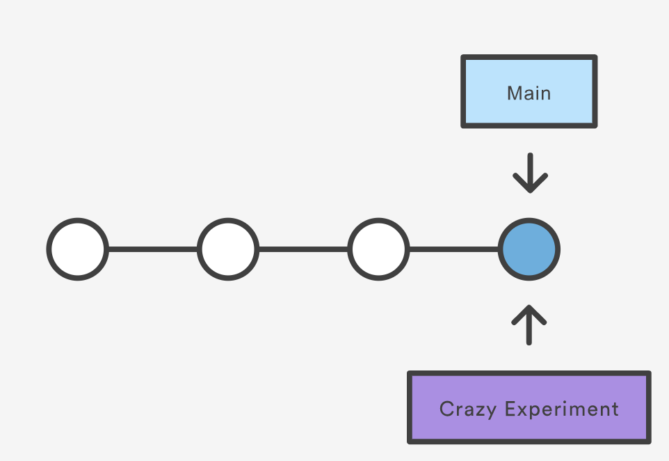
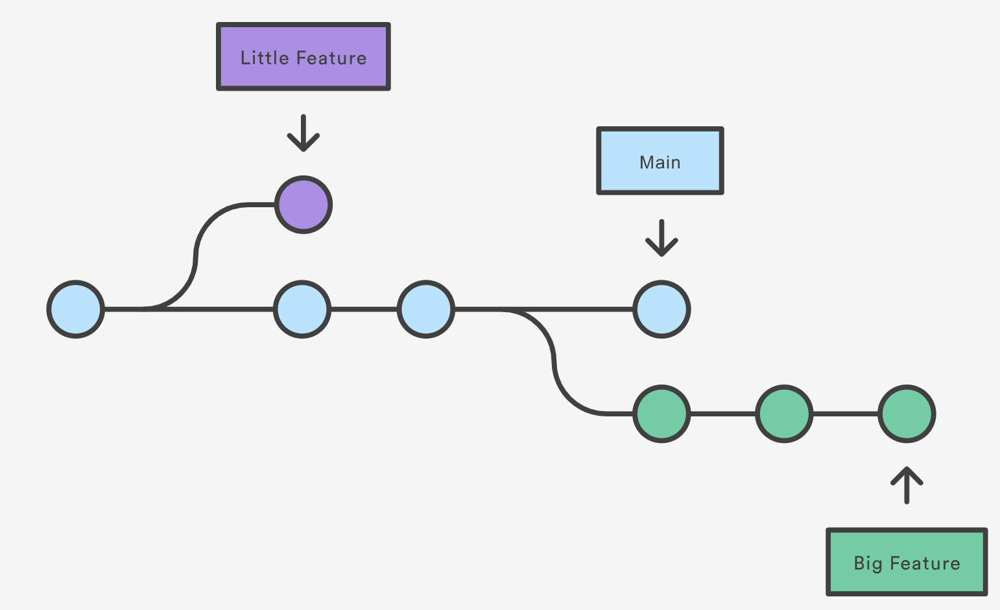

<!-- .slide: data-state="title" -->
## Git branches

What are branches and when should I use them?

===

<!-- .slide: data-state="standard" -->
## What is a branch?

  A branch is simply a pointer to a commit
  

  Creating a branch only creates a new pointer, nothing changes in your code
  

Note:
In git a branch is effectively a pointer to a snapshot of your changes. 
It’s important to understand that branches are just pointers to commits. 
When you create a branch, all Git needs to do is create a new pointer, 
it doesn’t change the repository in any other way.
Images come from https://carpentries-incubator.github.io/advanced-git/02-branching/index.html

===

<!-- .slide: data-state="standard" -->
## A branching workflow

Whenever you add a new feature or fix a bug, you work on a new branch.

Note:
Branching is a feature available in most modern version control systems. 
Branching in other version control systems can be an expensive operation in both time and disk space. 
In git, branches are a part of your everyday development process. 
When you want to add a new feature or fix a bug—no matter how big or how small—you spawn a new branch 
to encapsulate your changes. 
This makes it harder for unstable code to get merged into the main code base, 
and it gives you the chance to clean up your future’s history before merging it into the main branch.

===