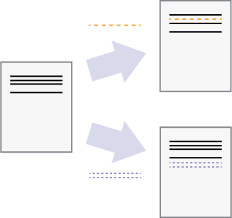

<!-- .slide: data-state="title" -->

# Automated Version Control

What is version control and why should I use it?

Note:
- Git all set up?
- SSH working?
- Otherwise: breakout room

===

<!-- .slide: data-state="standard" -->

“Piled Higher and Deeper” by Jorge Cham, http://www.phdcomics.com 

===

<!-- .slide: data-state="standard" -->
## Documents are...

  a series of changes
  

===

<!-- .slide: data-state="standard" -->
## Collaboration

  independent changes
  

  can be merged
  

===

<!-- .slide: data-state="standard" -->
## Version Control: Key Points

- Version control is track changes on steroids.
- Version control is like an unlimited **undo**.
- Version control also allows many people to work in parallel.

===

<!-- .slide: data-state="standard" -->
## The Holy Realms of Git

<ul>
  <li><b>workspace</b>&nbsp;&nbsp;📂</li>
  <ul>
    <li>Your filesystem</li>
  </ul>
  <li class="fragment"><b>index</b>&nbsp;&nbsp;🕒
    <ul>
      <li>Staging area</li>
      <li>Files wait patiently to be committed</li>
    </ul>
  </li>
  <li class="fragment"><b>local repository</b>&nbsp;&nbsp;🗂️
    <ul>
      <li>Contains branches, commits, history, etc.</li>
    </ul>
  </li>
<ul>

===

<!-- .slide: data-state="standard" -->
## Crowded Staging Area / Index

The Staging Area / Index can hold many files and folders.

===

<!-- .slide: data-state="standard" -->
## Quiz 1/2

<blockquote style="text-align: left;">
Which commit message should I choose?
<ol>
  <li>“Changes”</li>
  <li>“Added line ‘This project started as a joke’ to myfile.txt”</li>
  <li>“Discuss origin of the project”</li>
</ol>
</code></pre>
</blockquote>
<blockquote class="fragment" style="text-align: right;">
Make it short, descriptive, and imperative 🐺
</blockquote>
<blockquote class="fragment" style="text-align: right;">
So yeah, the last one is good! 🐺
</blockquote>

===

<!-- .slide: data-state="standard" -->
## Quiz 2/2

<blockquote style="text-align: left;">
Which command saves <b>myfile.txt</b> to my Git repo? 
<ol>
  <li>
    <pre style="width: 100%; font-style: normal;" data-id="code-animation"><code data-trim class="bash">
    $ git commit -m "my recent changes"
    </code></pre>
  </li>
  <li>
    <pre style="width: 100%; font-style: normal;" data-id="code-animation"><code data-trim class="bash">
    $ git init myfile.txt
    $ git commit -m "my recent changes"
    </code></pre>
  </li>
  <li>
    <pre style="width: 100%; font-style: normal;" data-id="code-animation"><code data-trim class="bash">
    $ git add myfile.txt
    $ git commit -m "my recent changes"
    </code></pre>
  </li>
  <li>
    <pre style="width: 100%; font-style: normal;" data-id="code-animation"><code data-trim class="bash">
    $ git commit -m myfile.txt "my recent changes"
    </code></pre>
  </li>
</ol>
</code></pre>
</blockquote>
<blockquote class="fragment" style="text-align: right;">
3. adds your file to the index, and then commits it. That's the one.
🐺
</blockquote>

===

<!-- .slide: data-state="standard" -->
## Tracking Changes: Key Points

- Files can be stored in
  - **working directory**: the files you can see
  - **staging area / index**: files about to be committed
  - **local repository**: the permanent record
- **git status**&nbsp; shows the status of a repository
- **git add**&nbsp; puts files in the staging area
- **git commit**&nbsp; saves the staged content as a new commit in the local repository
- Write short, descriptive, and imperative commit messages

===

<!-- .slide: data-state="standard" -->
## Exploring history

Use `git restore` with the `-s` option to retrieve a specific state. 

Note:
In this example we restore to the state before the most recent commit, 
which is `HEAD~1` or `f22b25e`

