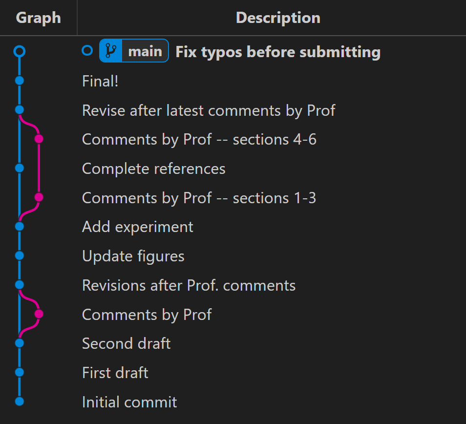
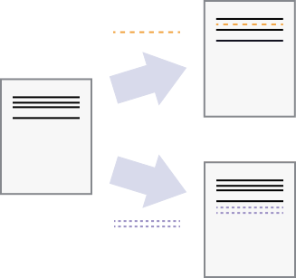
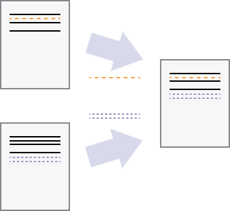

<!-- .slide: data-state="title" -->

# Automated Version Control

What is version control and why should I use it?

===

<!-- .slide: data-state="standard" -->

“Piled Higher and Deeper” by Jorge Cham, http://www.phdcomics.com 

===

<!-- .slide: data-state="standard" -->

## Controlling Versions

  

===

<!-- .slide: data-state="standard" -->
## Documents are...

  a series of changes
  

===

<!-- .slide: data-state="standard" -->
## Version Control: Key Points

- Version control is track changes on steroids.
- Version control is like an unlimited **undo**.
- Version control also allows many people to work in parallel.

===

<!-- .slide: data-state="standard" -->
## Configuration

Some minimal configuration to get started

<code data-trim class="bash">

$ git config --global user.name "Your Name"

$ git config --global user.email "your.email@example.com"

$ git config --global core.editor nano

</code>

===

<!-- .slide: data-state="standard" -->
## The Three Stages of Git

<ul>
  <li><b>workspace</b>&nbsp;&nbsp;📂</li>
  <ul>
    <li>Your filesystem</li>
  </ul>
  <li class="fragment"><b>index</b>&nbsp;&nbsp;🕒
    <ul>
      <li>Staging area</li>
      <li>Files wait patiently to be committed</li>
    </ul>
  </li>
  <li class="fragment"><b>local repository</b>&nbsp;&nbsp;🗂️
    <ul>
      <li>Contains branches, commits, history, etc.</li>
    </ul>
  </li>
<ul>

===

<!-- .slide: data-state="standard" -->
## Quiz

<blockquote style="text-align: left;">
Which commit message should I choose?
<ol>
  <li>“Changes”</li>
  <li>“Added line ‘This is a Coding Cafe demo project.' to README.txt”</li>
  <li>“Discuss origin of the project”</li>
</ol>
</code></pre>
</blockquote>
<blockquote class="fragment" style="text-align: right;">
3: Make it short, descriptive, and imperative 🧑‍🏫
</blockquote>

===

<!-- .slide: data-state="standard"
## Quiz

<blockquote style="text-align: left;">
Which command saves <b>myfile.txt</b> to my Git repo? 
<ol>
  <li>
    <pre style="width: 100%; font-style: normal;" data-id="code-animation"><code data-trim class="bash">
    $ git commit -m "my recent changes"
    </code></pre>
  </li>
  <li>
    <pre style="width: 100%; font-style: normal;" data-id="code-animation"><code data-trim class="bash">
    $ git init myfile.txt
    $ git commit -m "my recent changes"
    </code></pre>
  </li>
  <li>
    <pre style="width: 100%; font-style: normal;" data-id="code-animation"><code data-trim class="bash">
    $ git add myfile.txt
    $ git commit -m "my recent changes"
    </code></pre>
  </li>
  <li>
    <pre style="width: 100%; font-style: normal;" data-id="code-animation"><code data-trim class="bash">
    $ git commit -m myfile.txt "my recent changes"
    </code></pre>
  </li>
</ol>
</code></pre>
</blockquote>
<blockquote class="fragment" style="text-align: right;">
3. adds your file to the index, and then commits it. That's the one.
🧑‍🏫
</blockquote>

===
-->

<!-- .slide: data-state="standard" -->
## Tracking Changes: Key Points

- **git status**&nbsp; shows the status of a repository
- **git add**&nbsp; puts files in the staging area
- **git commit**&nbsp; saves the staged content as a new commit in the local repository
- Write short, descriptive, and imperative commit messages

===

<!-- .slide: data-state="standard" -->
## Exploring history

Use `git restore` with the `-s` option to retrieve a specific state. 

Note:
In this example we restore to the state before the most recent commit, 
which is `HEAD~1` or `f22b25e`

===

<!-- .slide: data-state="standard" -->
## Collaboration

  independent changes
  

  can be merged
  

===

<!-- .slide: data-state="standard" -->
## References

#### Cheat Sheets
<ul>
  <li>PDF
  <a href="https://wizardzines.com/git-cheat-sheet.pdf">wizardzines.com/git-cheat-sheet.pdf</a>
  </li>
  <li>Interactive
  <a href="https://ndpsoftware.com/git-cheatsheet.html#loc=index;">ndpsoftware.com/git-cheatsheet.html</a>
  </li>
</ul>

  

#### eScience Center
<ul>
  <li>
  <a href="esciencecenter.nl">esciencecenter.nl/about-us</a>
  </li>
  <li>Upcoming Workshops
  <a href="esciencecenter.nl">esciencecenter.nl/events</a>
  </li>
</ul>
