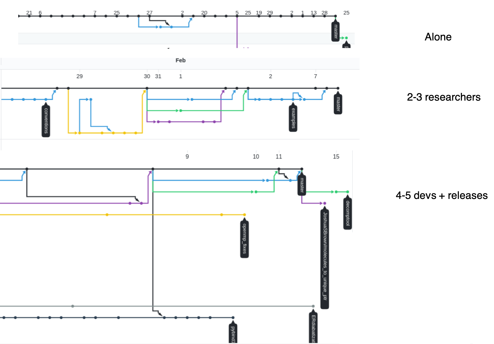

<!-- .slide: data-state="title" -->

# Good Practices for Research Software Development

note: 

===

<!-- .slide: data-state="standard" -->

<!-- .slide: data-state="standard"  -->

## Who are we?

+ **The Netherlands eScience Center is a national center for innovative software solutions in academic research**
+ **Our Research Software Engineers**
  - Help researchers interpret results
  - Make tools and methods reusable for the wider research community
  - Co-author research and methodological publications. 

===

## Programming vs Software Engineering

  

      Software engineering is programming integrated over time.
    <h4>&mdash;Titus Winters, Google C++ devlead</h4>
  

Note:
What's the difference between programming and software engineering?

===

<!-- .slide: data-state="standard" -->

===

<!-- .slide: data-state="standard" -->

## Development Speed ⚡

<ul>
  <li>Red curve
  <ul>
    <li>Writing code</li>
  </ul>
  <li>Blue curve
  <ul>
    <li>Version Control</li>
    <li>Collaborative development</li>
    <li>Code review</li>
    <li>Testing</li>
    <li>Modular code</li>
    <li>Documentation</li>
  </ul>
</ul>

===

<!-- .slide: data-state="standard" -->

## Projects are Different

===

<!-- .slide: data-state="standard" -->

## What to Use When?

  <table>
    <tr>
      <th>⏱️&nbsp;lifetime</th>
      <th>use</th>
    </tr>
    <tr>
      <td>1-shot</td>
      <td class="fragment" data-fragment-index="1">🚫</td>
    </tr>
    <tr>
      <td>week+</td>
      <td class="fragment" data-fragment-index="2">Git &amp; GitHub</td>
    </tr>
    <tr>
      <td>3 months+</td>
      <td class="fragment" data-fragment-index="3">Testing</td>
    </tr>
    <tr>
      <td>6 months+</td>
      <td class="fragment" data-fragment-index="4">Documentation, automate testing</td>
    </tr>
  </table>

  <table>
    <tr>
      <th>🧑🧑&nbsp;users</th>
      <th>use</th>
    </tr>
    <tr>
      <td>1</td>
      <td class="fragment" data-fragment-index="6">Push to main</td>
    </tr>
    <tr>
      <td>2+</td>
      <td class="fragment" data-fragment-index="7">Branches, merging</td>
    </tr>
    <tr>
      <td>2+ (+students)</td>
      <td class="fragment" data-fragment-index="8">Code review</td>
    </tr>
    <tr>
      <td>2+ (+external)</td>
      <td class="fragment" data-fragment-index="9">Release branch,  &amp; everything else</td>
    </tr>
  </table>

Note:
- Train these tools
- Experience their effect
- Use own judgement, but
- avoid "but in my project..."

===

<!-- .slide: data-state="standard" -->

## Good practices are investments

Profits come in

- Development efficiency
- Reproducibility
- Reusability
- Faster debugging
- Robustness, fewer errors
- Fewer headaches!