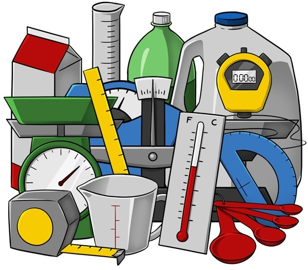

<!-- .slide: data-state="blue_overlay yellow_flag yellow_strip purple_half_circle_bottom purple_blob right_e_top" data-background-video="./media/testing/606762245.mp4" data-background-video-loop data-background-video-muted="true" -->
<!-- https://pixabay.com/videos/engine-motor-mechanic-technology-5497/ -->

# Testing

===

<!-- .slide: data-state="standard"  -->

## Basics of testing

### Mistakes *will* happen!

    

      <ul>
        <li class="fragment">The more complex the code, the harder to keep an eye on everything.</li>
        <li class="fragment">However, we can build safeguards against problems:
        <ul>
          <li class="fragment">Throwing exceptions</li>
          <li class="fragment">Logging (intermediate) results</li>
          <li class="fragment"><b>Writing tests</b></li>
        </ul></li>
      </ul>
  

    

===

<!-- .slide: data-state="standard" -->

## Why Test?

  

    <ul>
      <li class="fragment">Preserve functionality
      <ul>
        <li>Detect (new) errors early</li>
        <li>Avoid unexpected outputs</li>
      </ul></li>
      <li class="fragment">Help users
      <ul>
        <li>Verify correct installation</li>
        <li>Ensure reproducibility</li>
      </ul></li>
      <li class="fragment">Enable developers
      <ul>
        <li>Manage complexity</li>
        <li>Simplify refactoring</li>
        <li>Facilitate collaboration</li>
      </ul></li>
    </ul>
  

    

===

<!-- .slide: data-state="standard" -->

## Test Types

<ul>
  
    <li class="fragment fade-up" data-fragment-index="1">Exceptions in the code base
    <ul>
      <li>Intended to handle "expected" problems</li>
      <li>Sound an alarm as soon as the problem arises</li>
      <li>Provide clear feedback to the user</li>
  </ul></li>
  <li class="fragment fade-up" data-fragment-index="2">Unit testing
  <ul>
    <li>Smallest possible unit (module)</li>
    <li>No dependency on outside code...</li>
    <li>(... replace them with mocks, stubs, etc.)</li>
  </ul></li>
  
  <li class="fragment fade-up" data-fragment-index="3">Integration testing
  <ul>
    <li>Test interactions between units</li>
    <li>Can be on small scales, system wide, ...</li>
  </ul></li>
</ul>

===

<!-- .slide: data-state="standard" -->

## Testing frameworks

Most modern programming languages have good options to streamline testing

- Python: [Pytest](https://docs.pytest.org/en/7.3.x/)
- Java: [Junit](https://junit.org/junit5/)
- R: [testthat](https://testthat.r-lib.org/)
- Matlab: [Testing Frameworks](https://nl.mathworks.com/help/matlab/matlab-unit-test-framework.html?s_tid=CRUX_lftnav)
- Julia: [Test](https://docs.julialang.org/en/v1/stdlib/Test/)
- C++: [GTest](https://google.github.io/googletest/) (developed by Google) or [Catch2](https://catch2-temp.readthedocs.io/en/latest/index.html)
- etc.

===

<!-- .slide: data-state="standard" -->

## Testing metrics

#### Targets are arbitrary and indicative

  

    <ul>
      <li class="fragment fade-up">Coverage
        <ul>
          <li>Proportion of code that is executed</li>
          <li>Target >= 80%</li>
        </ul>
      </li>
      <li class="fragment fade-up">Ratio (lines of code:lines of test)
        <ul>
          <li>Target: (1:3)</li>
        </ul>
      </li>
      <li class="fragment fade-up">Metrics can be misleading
        <ul>
          <li>They do not measure quality</li>
          <li>Don't get blindsided by hitting targets over writing good tests</li>
  

  

===

<!-- .slide: data-state="standard" -->

## Write Code

<pre><code class="bash" style="overflow: hidden;" data-trim class="bash" data-line-numbers>
$ mkdir pytest-example
$ cd pytest-example
</code></pre>

Creating a file <code>example.py</code> containing
<pre><code class="python" style="overflow: hidden;" data-trim class="bash" data-line-numbers>
def add(a, b):
    return a + b
&nbsp;
&nbsp;
def test_add():  # Special name!
    assert add(2, 3) == 5  # What's `assert`? 🤔
    assert add('space', 'ship') == 'spaceship'
</code></pre>

Chat with the python shell about <code>assert</code> ...

<pre><code class="python" style="overflow: hidden;" data-trim class="bash" data-line-numbers>
>>> assert 1==1  # passes
>>> assert 1==2  # throws error
Traceback (most recent call last):
  File "&lt;stdin&gt;", line 1, in &lt;module&gt;
AssertionError
</code></pre>

===

<!-- .slide: data-state="standard" -->

## Test!

<pre><code style="overflow: hidden;" data-trim class="bash" data-line-numbers="1|1-9">
$ pytest example.py
======================== test session starts ========================
platform linux -- Python 3.6.9, pytest-7.0.1, pluggy-1.0.0
rootdir: /home/ole/Desktop/pytest-texample
collected 1 item

example.py .                                                  [100%]

========================= 1 passed in 0.00s =========================
</code></pre>

===

<!-- .slide: data-state="standard" -->

## Breaking Things

<pre><code class="python" style="overflow: hidden;" data-trim class="bash" data-line-numbers>
def add(a, b):
    return a - b  # Uh oh, mistake! 😱

def test_add():
    assert add(2, 3) == 5
    assert add('space', 'ship') == 'spaceship'
</code></pre>

===

<!-- .slide: data-state="standard" -->

## Testing Again

<pre><code style="overflow: hidden;" data-trim class="bash" data-line-numbers="1|2-8|9-17|18-20">
$ pytest example.py
======================== test session starts =========================
platform linux -- Python 3.6.9, pytest-7.0.1, pluggy-1.0.0
rootdir: /home/ole/Desktop/pytest-texample
collected 1 item

example.py F                                                   [100%]

============================== FAILURES ==============================
______________________________ test_add ______________________________

    def test_add():
>       assert add(2, 3) == 5
E       assert -1 == 5
E        +  where -1 = add(2, 3)

example.py:6: AssertionError
====================== short test summary info =======================
FAILED example.py::test_add - assert -1 == 5
========================= 1 failed in 0.05s ==========================
</code></pre>

<ul>
  <li class="fragment">🚀❓Functions fail on first error</li>
  <li class="fragment">But all test functions are executed</li>
</ul>

===

<!-- .slide: data-state="standard" -->

## Pytest wrap up

- pytest collects all files starting <code>test_</code>...
- ... and runs all test functions starting with <code>test_</code>
- The tests pass when they do not throw (assertion) errors

<pre style="width: max-content;"><code style="overflow: hidden;" class="python" data-trim class="bash" data-line-numbers>
def steal_sheep():
    ...
def paint_cows():
    ...

# optionally in another file:

def test_steal_sheep():
    ...
def test_paint_cows():
    ...
</code></pre>

===

<!-- .slide: data-state="standard" -->

## Take-away

- Use pure functions when possible 👌
  - Do you remember what these are? 💭
- Testing does not have to be hard 👏
  - You often test anyway, but then throw the test away 🧐
  - Use pytest if programming with Python 🎭
- You don't have to strive for 💯% test coverage
  - But be smart about what you are testing 🧠
- Aim for a balance between unit- and integration tests ⚖️
- Testing removes the dread of refactoring 🔁
- Your future you (and others!) will thank you 🙏

===

<!-- .slide: data-state="standard" -->

## Test-Driven Development: FizzBuzz

  
  
  
  
  
  

<ul class="fragment">
  <li>fizz_buzz() takes an integer argument and returns it, BUT</li>
  <ul>
    <li class="fragment" data-fragment-index="1">fails on zero or negative numbers</li>
    <li class="fragment" data-fragment-index="2">instead returns "Fizz" on multiples of 3</li>
    <li class="fragment" data-fragment-index="3">instead returns "Buzz" on multiples of 5</li>
    <li class="fragment" data-fragment-index="5">instead returns "FizzBuzz" on multiples of 3 and 5</li>
  </ul>
</ul>

===

<!-- .slide: data-state="standard" -->

## Test driven development assignment:

<ul>
  <li>Create a test function that checks the rules of FizzBuzz:</li>
  <ul>
    <li>fails on zero or negative numbers</li>
    <li>return "Fizz" on multiples of 3</li>
    <li>return "Buzz" on multiples of 5</li>
    <li>return "FizzBuzz" on multiples of 3 and 5</li>
    <li>otherwise return itself</li>
  </ul>
  <li class="fragment">Paste your tests in the collab document, and discuss</li>
  <li class="fragment">Now write a function code to make your tests pass</li>
</ul>

===

<!-- .slide: data-state="standard" -->

## Take-away

- What did you think of this style of development?
- Was it easier or harder than just writing code?
- Would your code look different without the tests? <!-- .element class="fragment" -->
- For what kind of projects would it be (not) useful? <!-- .element class="fragment" -->

**Test-Driven Development (TDD) is an optional tool in your toolbox** 🛠️ <!-- .element class="fragment" -->