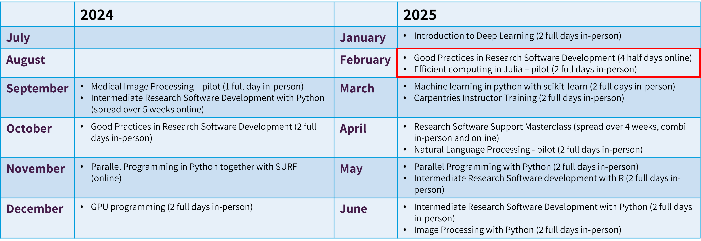

<!-- .slide: data-state="title" -->

## Training Programme schedule 2024-2025

===

<!-- .slide: data-state="standard" -->

  

  <ul>
    <li><strong>For exact dates of upcoming workshops (3 months in advance): </strong></li>
      <ul>
        <li>esciencecenter.nl/events/?f=workshops</li>
        <li>To be notified about coming up workshops, subscribe to the Newsletter: eepurl.com/dtjzwP</li>
      </ul>
    </li>
  </ul>

